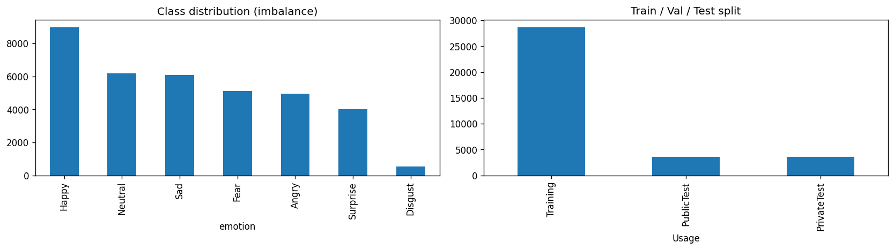
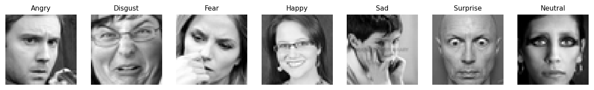
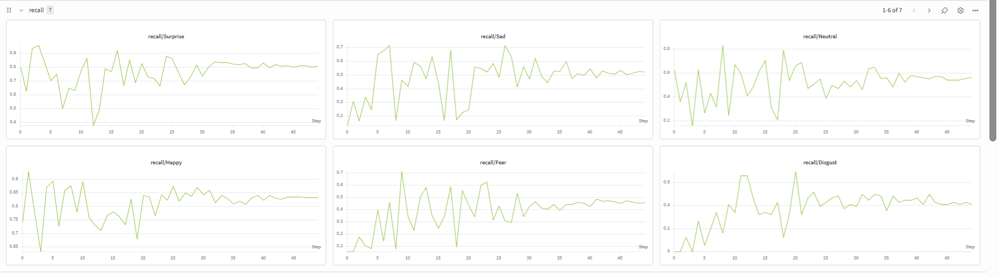
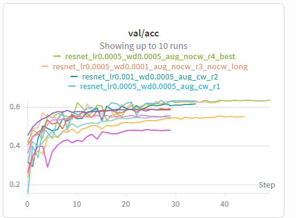
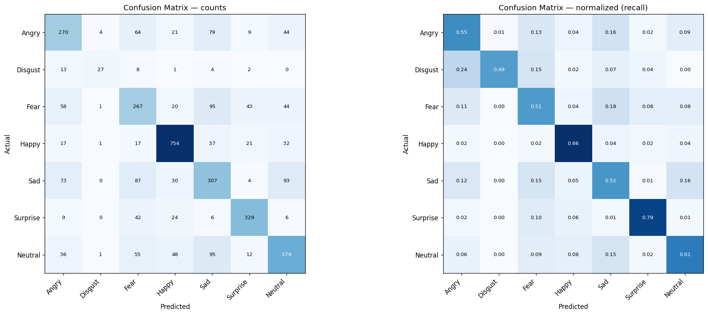
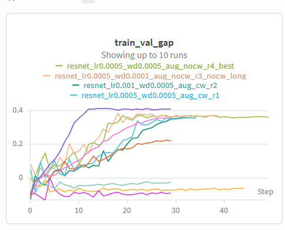

# FER2013 — სახის ემოციების ამოცნობა (Facial Expression Recognition)

CNN არქიტექტურების იტერაციული შესწავლა PyTorch-ში FER2013 დატასეტზე, სრული ექსპერიმენტული ტრექინგით [Weights & Biases](https://wandb.ai/vdand23-free-university-of-tbilisi-/fer2013-emotion)-ზე.

> **მთავარი აქცენტი:** არა მხოლოდ მაღალი accuracy, არამედ მოდელის ქცევის — **underfit / overfit / რეგულარიზებული** რეჟიმების — სისტემური დემონსტრაცია და ანალიზი. არქიტექტურები აშენებულია იტერაციულად, პატარადან დიდისკენ, და თითოეული გადაწყვეტილება დასაბუთებულია.

---

## 1. ამოცანა

48×48 ზომის შავ-თეთრი სახის სურათების კლასიფიკაცია **7 ემოციად**: Angry, Disgust, Fear, Happy, Sad, Surprise, Neutral. შეფასების მეტრიკა — accuracy.

## 2. მონაცემები

| მახასიათებელი | მნიშვნელობა |
|---|---|
| სურათები | 35,887 (48×48, grayscale) |
| Train (`Training`) | 28,709 |
| Validation (`PublicTest`) | 3,589 |
| Test (`PrivateTest`) | 3,589 |

დატასეტს გააჩნია მზა `Usage` სვეტი train/val/test გაყოფისთვის. **Test გამოიყენება მხოლოდ ფინალური შეფასებისთვის** — სწავლების ან hyperparameter-ის შერჩევისას მას არ ვეხებით.

### 2.1 EDA




**კლასების ძლიერი დისბალანსი** (Training): Happy — 7,215, Neutral — 4,965, Sad — 4,830, Fear — 4,097, Angry — 3,995, Surprise — 3,171, **Disgust — მხოლოდ 436** (16-ჯერ ნაკლები Happy-ზე).

აქედან სამი გადაწყვეტილება:
1. **Class weights** — ინვერსიულ-სიხშირული წონები loss-ში, რომ იშვიათი კლასები არ დაიკარგოს.
2. საერთო accuracy მატყუარაა → ვაკვირდებით **per-class recall**-სა და **confusion matrix**-ს.
3. **Macro-F1** — მეტრიკა, რომელიც კლასებს თანაბრად აწონის.

Pixel-ები 0–255 → **ნორმალიზდება** [-1, 1] შუალედში.

## 3. მეთოდოლოგია

### 3.1 Sanity checks (forward / backward შემოწმება)

რეალურ სწავლებამდე ვამოწმებთ pipeline-ის გამართულობას:

- **Init loss ≈ ln(7) ≈ 1.946** — შემთხვევით წონებზე მიღებული: **1.97** ✓ (გამომავალი ფენა და label-ები სწორია).
- **Overfit one batch** — ერთ batch-ზე 200 ნაბიჯში `acc = 1.0` ✓ (gradient flow და optimizer მუშაობს).

### 3.2 სწავლების კონფიგურაცია

Optimizer — AdamW; Scheduler — CosineAnnealingLR; Loss — CrossEntropy (class weights არჩევითად); Augmentation — random horizontal flip. სიჩქარისთვის მონაცემები ერთხელ გადამუშავდება tensor-ად მეხსიერებაში (string-parsing აღარ მეორდება ეპოქებში; ~2.6 წმ/ეპოქა tiny-ზე).

## 4. არქიტექტურები — იტერაციული მიდგომა

| არქიტექტურა | პარამეტრები | როლი |
|---|---|---|
| TinyCNN | 64K | underfit baseline  |
| SimpleCNN | 1.27M | overfit-ის დემონსტრაცია |
| CNN_BN | 1.27M | რეგულარიზაცია (overfit-ის გადაჭრა) |
| ResNetMini | 2.78M | საუკეთესო მოდელი |

### 4.1 TinyCNN — underfit

ერთი conv ფენა, მინიმალური capacity. **შედეგი:** val ≈ 0.47, train ≈ 0.40 — მოდელი train-საც კი ვერ სწავლობს.

გადამწყვეტი ექსპერიმენტი — `long` (40 vs 20 ეპოქა): accuracy 0.467 → 0.471, **ორმაგი დროით მხოლოდ +0.4%**. ეს ამტკიცებს, რომ underfit **დროის ნაკლი არ არის — ის capacity-ის ფუნდამენტური ჭერია**. `noaug`-მა val ოდნავ აწია (0.485) — სუსტ მოდელს augmentation ამძიმებს, ანუ რეგულარიზაცია underfit-ისას ზედმეტია.

### 4.2 SimpleCNN — overfit

3 conv ბლოკი BatchNorm/Dropout-ის გარეშე. capacity გაიზარდა, რეგულარიზაცია განზრახ ამოღებულია.

**შედეგი:** train ≈ 0.85, val ≈ 0.58 → **gap ≈ 0.28** — overfit-ის სუფთა ხელმოწერა. `val/loss` ~8 ეპოქის შემდეგ **იწევს** (1.5 → 3.0), თუმცა val/acc ჯერ ოდნავ იზრდება — დამზეპირების ნიშანი. weight decay/augmentation-მა peak accuracy დიდად ვერ შეცვალა, მაგრამ **gap დახურა და test/val დააახლოვა**.

### 4.3 CNN_BN — რეგულარიზაცია

**ზუსტად SimpleCNN-ის ზომა (1.27M)** + BatchNorm + Dropout. სუფთა ექსპერიმენტი: თუ gap დაიხურა, ეს მხოლოდ რეგულარიზაციის დამსახურებაა, არა capacity-ის.

| dropout | gap | test acc |
|---|---|---|
| 0.0 (მხოლოდ BN) | ~0.23 | **0.611** |
| 0.3 | ~0.10 | 0.570 |
| 0.5 | ~0.03 | 0.529 |

**კრიტიკული დასკვნა:** *gap-ის დახურვა ≠ უკეთესი მოდელი.* dropout=0-მა საუკეთესო accuracy მისცა (overfit-ით); dropout=0.5-მა overfit მოკლა, მაგრამ accuracy ჩამოაგდო (over-regularization — capacity დაიხშო). ოპტიმუმი შუაშია.

#### Hyperparameter search (8 run)

- **learning rate:** lr=5e-4 საუკეთესო (0.586); lr=3e-3 → **კატასტროფა (0.42)** — training ვერ კრებადდება, მხოლოდ მარტივ კლასებს იჭერს.
- **batch size:** პატარა (64–128) სჯობს დიდს (256) — ნაკლები gradient noise.
- **weight decay:** ზომიერი (5e-4) საუკეთესო; ძალიან დიდი (1e-3) აზიანებს.

### 4.4 ResNetMini — საუკეთესო მოდელი

Residual connections — ღრმად წასვლა გრადიენტის გაქრობის გარეშე. **შედეგი:** test **0.65**, val 0.64 — ყველაზე მაღალი. cnn_bn-ის ჭერი (~0.61) გადალახულია **არქიტექტურის გაძლიერებით, არა hyperparameter-ის თელვით**.

ყველაზე მნიშვნელოვანი — რთული კლასები გაუმჯობესდა: Fear 0.276 → **0.458**, Angry 0.308 → **0.580**, Sad 0.338 → **0.521**. ResNet ისევ overfit-ობს (gap ≈ 0.33), მაგრამ val მაინც ყველაზე მაღალია — დიდი capacity ერთდროულად აზეპირებსაც და აზოგადებსაც.



## 5. შედეგების შეჯამება

| არქიტექტურა | params | best val/acc | test/acc | რეჟიმი |
|---|---|---|---|---|
| TinyCNN | 64K | 0.485 | 0.484 | **underfit** |
| SimpleCNN | 1.27M | 0.587 | 0.586 | **overfit** |
| CNN_BN | 1.27M | 0.596 | 0.611 | regularized |
| **ResNetMini** | 2.78M | **0.639** | **0.650** | **best** |



## 6. Confusion Matrix და per-class ანალიზი (საუკეთესო მოდელი)



| კლასი | precision | recall | f1 |
|---|---|---|---|
| Happy | 0.840 | 0.858 | 0.849 |
| Surprise | 0.783 | 0.791 | 0.787 |
| Neutral | 0.634 | 0.605 | 0.619 |
| Angry | 0.567 | 0.550 | 0.558 |
| Disgust | 0.794 | 0.491 | 0.607 |
| Sad | 0.493 | 0.517 | 0.505 |
| Fear | 0.494 | 0.506 | 0.500 |

**დაკვირვებები:**
- **Happy და Surprise** ყველაზე ზუსტია — მკაფიო ვიზუალური ნიშნები + ბევრი მაგალითი.
- **Disgust-ის ასიმეტრია** (precision 0.79, recall 0.49): მოდელი იშვიათად ამბობს „Disgust", მაგრამ როცა ამბობს — ჩვეულებრივ მართალია. დისბალანსის (436 მაგალითი) პირდაპირი შედეგი; ხშირად Angry-ში ერევა (მსგავსი წარბები).
- **Fear ↔ Sad ↔ Neutral აღრევა** — ცენტრალური სისუსტე. ეს სამი ემოცია ვიზუალურად ჰგავს ერთმანეთს; ეს FER2013-ის ფუნდამენტური სირთულეა, არა მოდელის ბაგი.

## 7. Overfit / Underfit ანალიზი (პროექტის ცენტრალური ნაწილი)

`train_val_gap` მეტრიკა ერთ გრაფიკში აჩვენებს ორ რეჟიმს:

- **Underfit (tiny):** დაბალი train *და* val, პატარა gap. მიზეზი — capacity-ის სიმცირე. დროის/lr-ის გაზრდა არ შველის.
- **Overfit (simple):** მაღალი train, ჩამორჩენილი val, დიდი gap, `val/loss` იწევს. მიზეზი — capacity რეგულარიზაციის გარეშე + მონაცემთა შეზღუდულობა.
- **გადაჭრა (cnn_bn / resnet):** BatchNorm + Dropout + Augmentation gap-ს აკონტროლებს.

  

გრაფიკები: [Wandb project »](https://wandb.ai/vdand23-free-university-of-tbilisi-/fer2013-emotion)

## 8. რეპოზიტორიის სტრუქტურა
ML_Wandb/

├── README.md

├── requirements.txt

├── .gitignore

├── src/

│   ├── data.py        # Dataset, DataLoader, class weights

│   ├── models.py      # 5 არქიტექტურა (tiny → resnet)

│   ├── engine.py      # train/eval loop, metrics

│   ├── sanity.py      # forward/backward შემოწმება

│   └── train.py       # wandb run ლოგიკა

├── configs/

│   └── experiments.py # ყველა ექსპერიმენტის კონფიგი

├── sweeps/

│   └── sweep.yaml     # wandb sweep კონფიგი

└── assets/            # EDA და confusion matrix გრაფიკები

## 9. რეპროდუცირება

```bash
pip install -r requirements.txt
```
Colab-ში secrets-ში ჩაამატე `KAGGLE_API_TOKEN`, `WANDB_KEY`, `GITHUB_TOKEN`; ჩამოტვირთე დატა (`kagglehub.dataset_download('deadskull7/fer2013')`); გაუშვი ექსპერიმენტები `configs/experiments.py`-დან.

## 10. Wandb

- **Project:** https://wandb.ai/vdand23-free-university-of-tbilisi-/fer2013-emotion
- **Runs:** 24+ (tiny, simple, cnn_bn, hyperparameter search, resnet)
- **Logged:** train/val loss & acc, macro-F1, train_val_gap, per-class recall, lr, confusion matrix, GPU metrics
